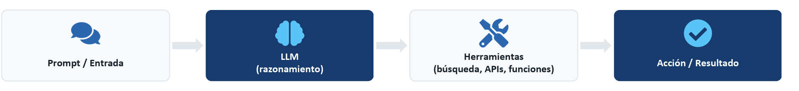
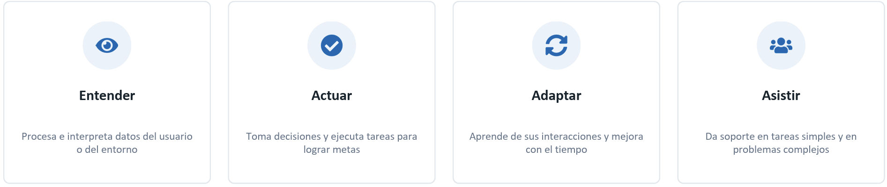
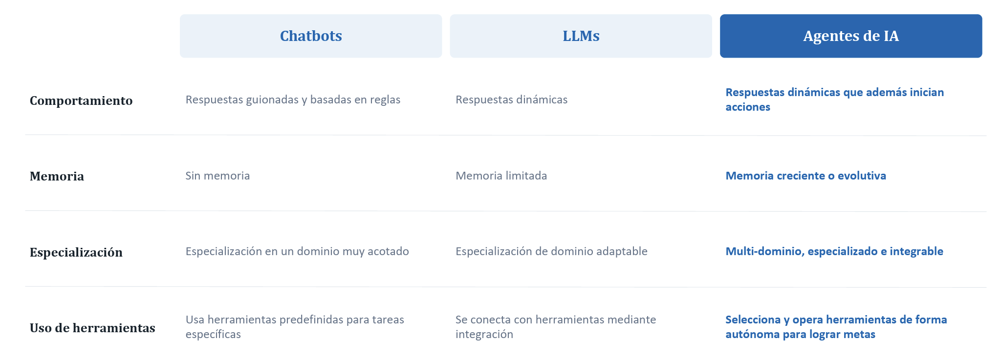
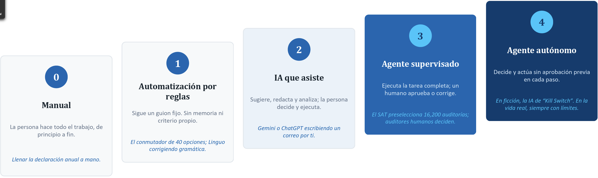
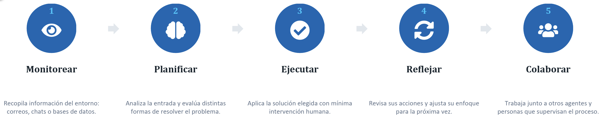
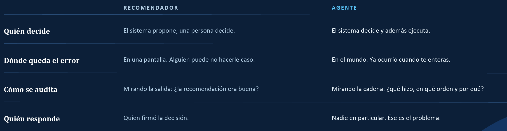
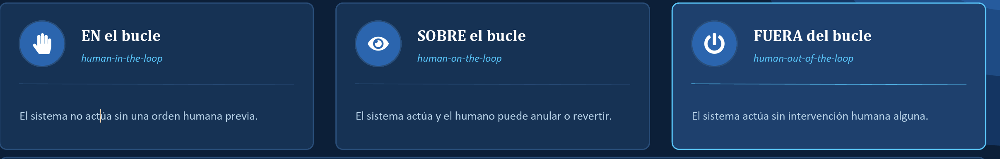

# ¿Qué	es	un	Agente	de	IA?
Un componente de software que utiliza un Modelo de Lenguaje (LLM) y herramientas externas para actuar de forma independiente, comunicarse con su entorno y tomar decisiones que cumplan metas definidas por el usuario o el sistema. 
- Agencia y autonomía 
- Auto-dirección 
- Adaptabilidad 
- Mínima intervención humana

# ¿Cómo	funciona	un	Agente	de	IA?

## El	ciclo	cotidiano	de	un	agente

# IA	Tradicional,	Generativa	y	Agéntica
## Tradicional: Predice / Clasifica 
Resuelve problemas bien definidos con aprendizaje supervisado o no supervisado. Es determinista. Ej. Google Maps, motores de recomendación 	

## IA Generativa : Genera / Crea IA 
Produce contenido nuevo y creativo a partir de grandes volúmenes de datos. No es determinista. Ej. ChatGPT, Gemini generando texto e imágenes  

## IA Agéntica: Actúa
Toma decisiones autónomas orientadas a una meta, con aprendizaje contextual continuo. Ej. flujos automatizados con AutoGPT, CrewAI

# Chatbots,	LLMs	y	Agentes	de	IA:	diferencias	clave

# Cuatro	rasgos	que	definen	a	un	Agente	de	IA
- Autonomía: Opera de forma independiente y decide sin intervención humana constante.
- Reactividad: Detecta y responde a cambios de su entorno en tiempo real.
- Proactividad: Anticipa necesidades y toma la iniciativa antes de que se lo pidan. 
- Colaboración: Se comunica y coordina con personas u otros agentes.

# Siete	tipos	de	Agentes	de	IA
- Reflejo	Simple: Responde a reglas fijas al instante; no aprende ni recuerda.
- Basado en Modelo: Mantiene un modelo interno del entorno para decidir con contexto.
- Basado	en	Metas: Planifica acciones evaluando resultados futuros posibles.
- Basado	en	Utilidad: Compara alternativas y elige la de mayor utilidad esperada.
- Jerárquico: Divide tareas complejas en subtareas por niveles de control.
- Sistema	Multi-Agente: Varios agentes autónomos colaboran o compiten como pares.
- Ambiental: Opera en segundo plano y actúa sin instrucciones explícitas.

“Agente”	no	es	un	interruptor	de	sí	o	no:	es	un	espectro.	Ubicar	en	qué	peldaño	está	una	herramienta	es	la	habilidad	práctica	de	este	tema.

# El	flujo	de	trabajo	agéntico:	5	etapas

# Lo que sigue siendo irremplazablemente humano
- Inteligencia emocional: La IA halla patrones en los comentarios, pero no la frustración detrás. 
- Creatividad e innovación: Las campañas por IA empiezan a parecerse a las de todos. El creativo devuelve la voz propia.
- Ética y responsabilidad: El agente descarta a un candidato sin título que tenía campañas exitosas. La reclutadora corrige el filtro. 
- Construcción de relaciones: El cliente no confía una decisión importante a una respuesta automática.

# Las cinco competencias para trabajar con IA Agéntica
- Alfabetización digital y fluidez en IA: Entender cómo piensan y actúan los sistemas agénticos, y dónde sigue siendo indispensable la persona. 
- Pensamiento crítico y resolución de problemas: Evaluar las salidas de la IA, detectar sesgos y combinar los datos con el juicio propio.
- Razonamiento ético y uso responsable: Garantizar equidad, transparencia y rendición de cuentas en decisiones asistidas por IA. 
- Interacción con sistemas autónomos: Diseñar instrucciones claras, supervisar el comportamiento del agente y sostener la confianza. 
- Aprendizaje continuo y adaptabilidad: Mantenerse al día con herramientas que cambian rápido y aprender de la retroalimentación.

# El	cambio	que	lo	cambia	todo:	de	recomendar	a	actuar

# El	trío	letal:	cuándo	un	agente	se	vuelve	peligroso
- Acceso	a	datos	privados: Puede leer información que no debería salir.
- Exposición	a	contenido	no	confiable: Lee correos, páginas o archivos que alguien más escribió.
- Capacidad	de	comunicación: Puede mandar algo hacia afuera: correo, API, publicación.

# Los	tres	niveles	de	supervisión	humana

